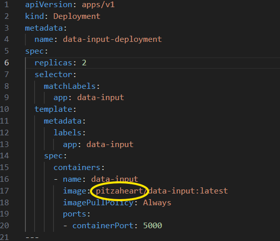
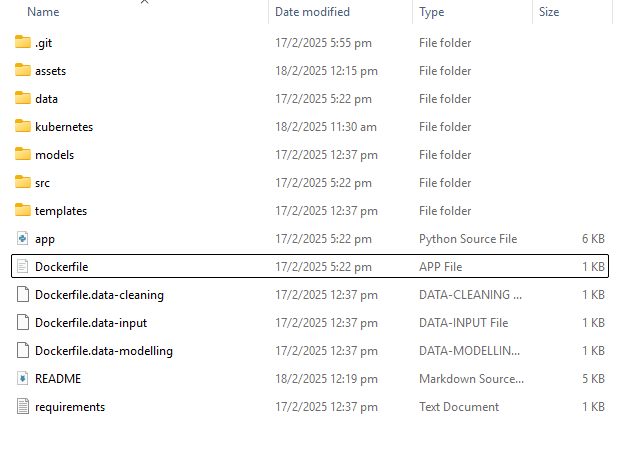
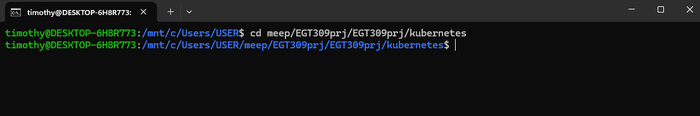
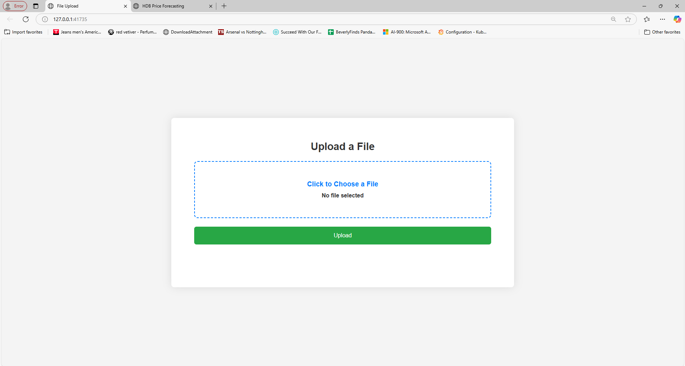
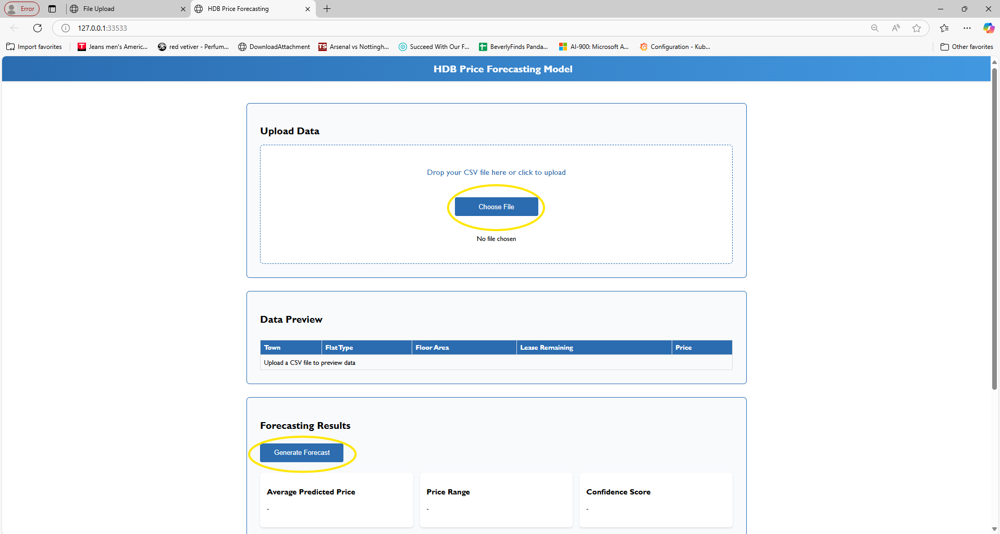
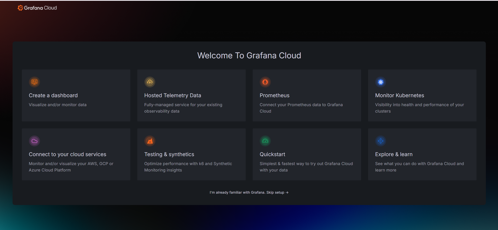
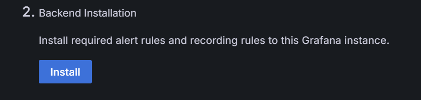
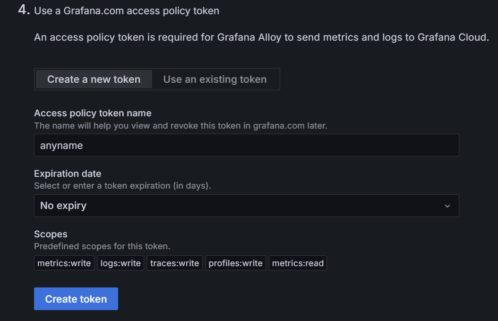
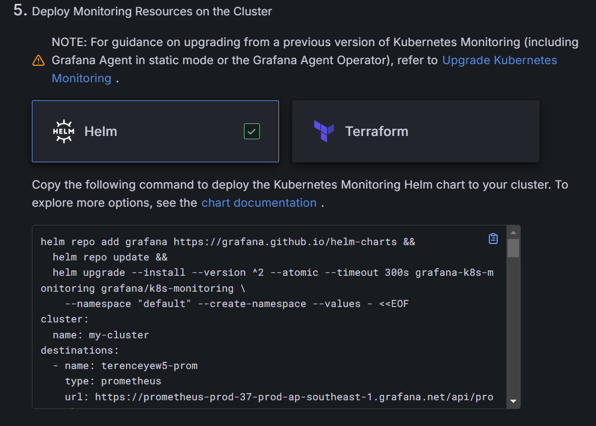
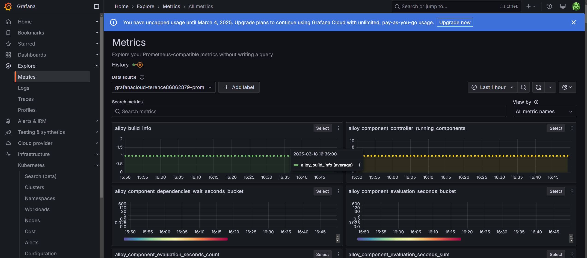

# EGT309 PROJECT
GitHub Link: https://github.com/begins-rag/EGT309prj

## Overview

In this project, we will be deploying 4 python files into a kubernetes cluster as an end to end AI solution.

We decided to create a sales forcesating model of singapores housing prices consisting of 4 modules, data input, data cleaning, data modelling and user interface.

<!-- ------------------------------------------------------ -->

## Folder Structure  

- /data: Contains raw data which would be inserted into data loading application.
- /src: Contains the source code for the created applications.
    - applications:
        - /data input.py : Handles data cleaning such as the removal of columns and duplication handling.
        - /data cleaning.py: Handles the feature engineering of data as well as the encoding of features for model training.
        - /data modelling.py : Handles the training of various models written within pipeline as well as producing the metrics report.

- /kubernetes: Contains the yaml files for deployment for each applications.
- /templates: Cotains the HTML user interface for app.py
- /models: Contains the preprocessed, clean and transformed data as well as the pkl regression model used in app.py.
- /assets: Folder to store all images for Readme.  
- /requirements: text file with all the necessary libraries meant for dockerfile to install.
- app.py: Client facing application where users can generate forecast.
- Dockerfiles (meant for the deployment of our docker files)
    - /Dockerfile.app
    - /Dockerfile.data-cleaning
    - /Dockerfile.data-input
    - /Dockerfile.data-modelling

<!-- ------------------------------------------------------ -->

## Technical Requirements

- 1️ Programming Language
    - Python 3.9+

- 2️ Operating System
    - Windows 10 or later
    - Linux-based WSL (if applicable)

- 3️ Containerization & Orchestration
    - Docker: 27.2.0
    - Kubernetes: v1.32.2
    - Minikube: v1.35.0
    - Helm: v3.17.1

- 4️ Deployment & Monitoring
    - Flask application running in Kubernetes (Minikube)
    - Helm charts for deployment
    - Grafana Alloy for observability
    - OTLP gRPC/HTTP & Zipkin endpoints for telemetry data

## Pipeline Execution Instructions

1. Enter docker terminal and login into docker   
`docker login`

2. Check the manifest files and ensure that the image is set to your docker username 

3. To build the docker images  
    `docker build -t <dockerhub username>/app:latest -f Dockerfile.app .`  
    `docker build -t <dockerhub username>/data-cleaning:latest -f Dockerfile.data-cleaning .`  
    `docker build -t <dockerhub username>/data-modelling:latest -f Dockerfile.data-modelling .`  
    `docker build -t <dockerhub username>/data-input:latest -f Dockerfile.data-input .`  

4. To push the docker images to docker hub  
    `docker push <dockerhub username>/app:latest`  
    `docker push <dockerhub username>/data-cleaning:latest`  
    `docker push <dockerhub username>/data-modelling:latest`  
    `docker push <dockerhub username>/data-input:latest`  

5. Enter the WSL distribution and navigate to kubernetes folder within project folder  
  

6. Enter the following commands to deploy the applications using the yaml files 
    `kubectl apply -f data-input-deployment.yaml`  
    `kubectl apply -f app-deployment.yaml`  
    `kubectl apply -f data-cleaning-deployment.yaml`  
    `kubectl apply -f data-modelling-deployment.yaml`  
    `kubectl apply -f model-pvc.yaml`  

7. Check whether pvc status is *BOUND*  
`kubectl get pvc`  

8. Check whether all pods are *RUNNING*  
`kubectl get pods`  

9. Get the URL for data input application using the following command  
`minikube service data-input-service --url`  

10. Get the URL for client facing application using the following command  
`minikube service app-service --url`  

11. After inputing raw data into the data loading, wait for model to train finish before generating and previewing forecast and data  
  
  

*REMEMBER TO INPUT RAW DATA INTO data_input.py*   
*REMEMBER TO INPUT CLEANED DATA INTO app.py *

## Grafana Execution Instructions
1. Head over to the website below and register a new account:
https://grafana.com/products/cloud/?src=ggl-s&mdm=cpc&camp=b-grafana-exac-apac&cnt=118051266643&trm=grafana&device=c&gad_source=1&gclid=Cj0KCQiA_NC9BhCkARIsABSnSTbeseDpw-C4qUfvUV47XsEZAJb3z42ybpF4lb8ObyLCz6FMNz0h9-oaAuw2EALw_wcB

2. After registering for an account, a pop-out will be shown. Please refer to the picture below and click on "Monitor Kubernetes".   
  

3. After clicking on "Monitor Kubernetes", you will be directed to a page to deploy monitoring resources on Kubenetes Cluster. Please refer to the pictures below to install and create token.   

4. After step 3 is done, please download helm in WSL.   
`sudo snap install helm`

5. After step 4 have been completed, copy and paste the commands given. You may refer to the picture below to see where are the commands to copy.   

6. After everything have been downloaded successfully in WSL, you may head back to Grafana Cloud and search "Metrics".  
  
This allows you to check the metrics of the Kubernetes Cluster, you may also check the logs of the applications also. 
